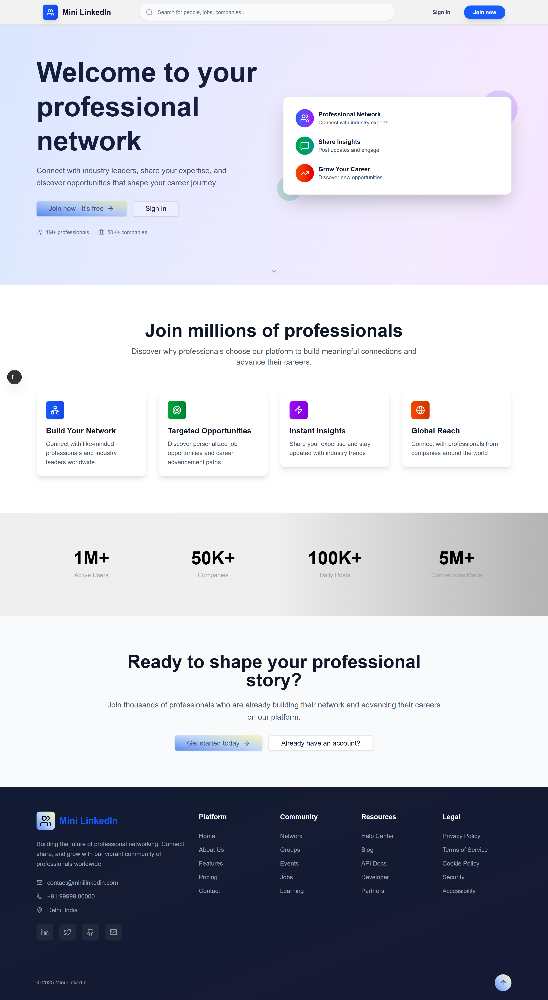
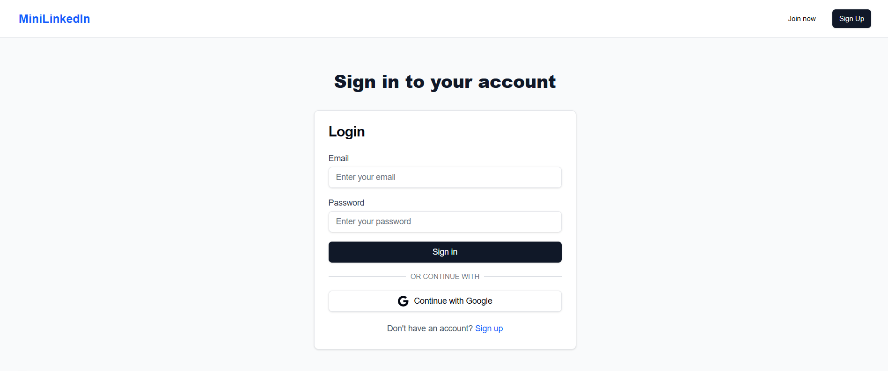
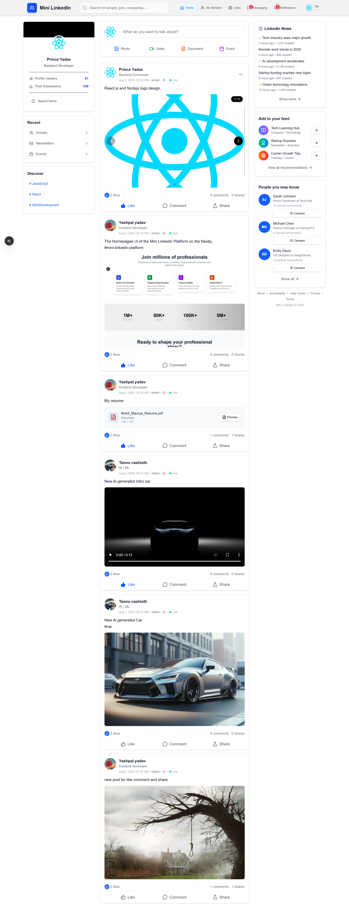
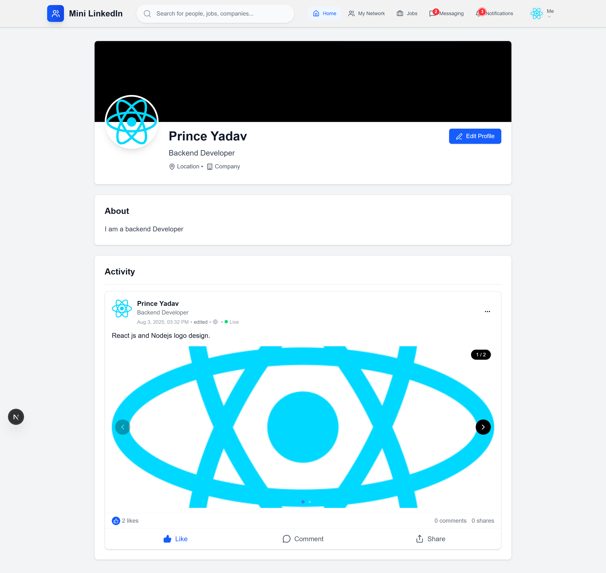
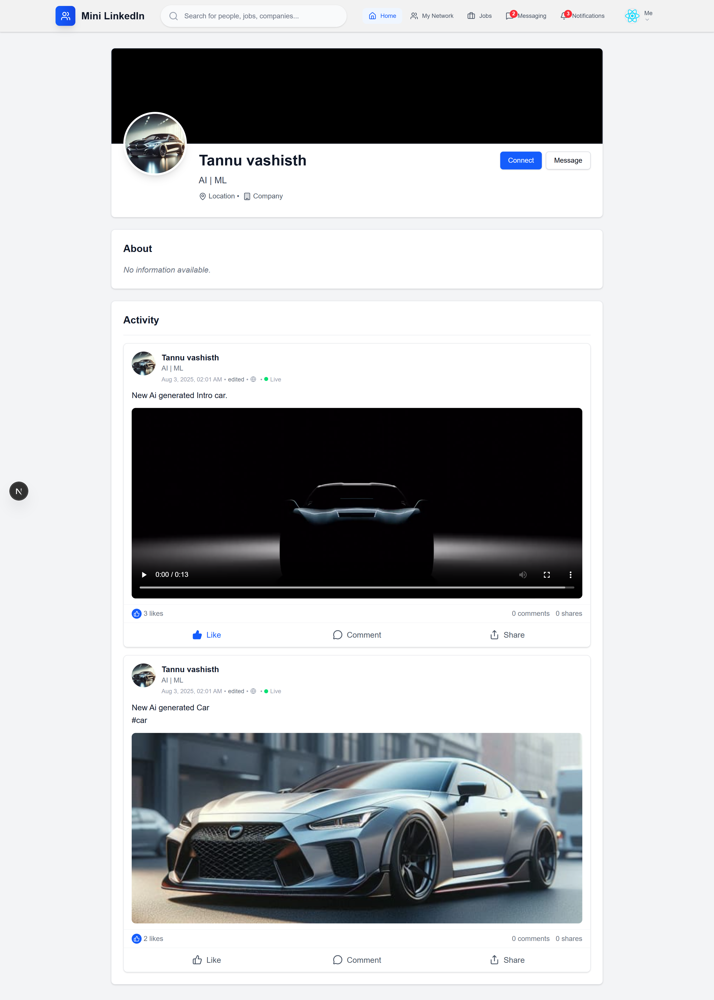
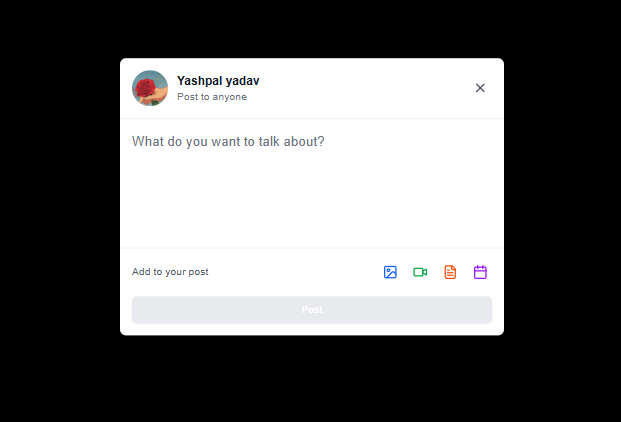

# Mini LinkedIn-Style Community Platform

A full-stack social networking application inspired by professional networking platforms. The project combines Next.js, React, Firebase Authentication, MongoDB, and Express.js to provide account management, user profiles, content sharing, search, and social-feed functionality.

## 🌐 Project Overview

This application provides a lightweight professional networking experience where users can:

* Create and manage accounts
* Build and update their profiles
* Publish posts
* Interact with posts
* Search for users and content
* Upload profile and post media

## 📸 Screenshots

### Landing & Home Page



*Application landing page and primary user interface.*

### Authentication



*User sign-in interface powered by Firebase Authentication.*

### Social Feed



*Main feed displaying posts and user activity.*

### Profile Management



*Profile page with user information and profile-management features.*

### Other User Profile



*View of another user's profile and associated content.*

### Post Creation



*Interface for creating posts and uploading media.*

---

## ✨ Main Features

### Authentication

* Firebase Authentication for account registration and login
* Email and password based authentication
* Authentication-aware application routes
* Automatic creation of a corresponding user profile

### User Profiles

* Personal profile containing basic information and biography
* Profile editing
* Avatar support with initials as a fallback
* Display of posts created by individual users

### Social Feed

* Publish text-based posts
* Display posts in a centralized feed
* Show author and posting information
* Like and share functionality
* Comment support
* Media support for posts

### Responsive Interface

* Responsive layouts for different screen sizes
* Tailwind CSS based styling
* Shadcn UI components
* Dark-mode support
* Reusable interface components

### Search

* Search for users and posts
* Dedicated search-results page
* Responsive search experience
* Lucide icons for interface elements

---

## 🧰 Technology Stack

### Frontend

* **Next.js 15** — React framework using the App Router
* **React 19** — Component-based UI library
* **Tailwind CSS** — Utility-first styling framework
* **Shadcn UI** — Reusable UI components
* **Lucide React** — Icon library
* **Lenis** — Smooth scrolling
* **Swiper** — Media carousel functionality

### Backend

* **Express.js** — Server-side web framework
* **MongoDB** — NoSQL database
* **Mongoose** — MongoDB ODM

### Authentication

* **Firebase Authentication** — Account authentication and session management

### Media

* **Cloudinary** — Media storage and delivery

---

# 📦 Getting Started

## Requirements

Before running the application, install or configure:

* Node.js 18 or later
* MongoDB, either locally or through MongoDB Atlas
* A Firebase project
* A Cloudinary account if media-upload functionality is required

## 1. Clone the Repository

```bash
git clone <repository-url>
cd mini-linkedin-platform
```

## 2. Install Packages

Install the frontend dependencies:

```bash
npm install
```

Install the backend dependencies:

```bash
npm run server:install
```

## 3. Configure Environment Variables

Create `.env.local` in the project root.

### Frontend

```env
NEXT_PUBLIC_API_URL=http://localhost:5000/api
NEXT_PUBLIC_FIREBASE_API_KEY=your-firebase-api-key
NEXT_PUBLIC_FIREBASE_AUTH_DOMAIN=your-project.firebaseapp.com
NEXT_PUBLIC_FIREBASE_PROJECT_ID=your-project-id
NEXT_PUBLIC_FIREBASE_STORAGE_BUCKET=your-project.appspot.com
NEXT_PUBLIC_FIREBASE_MESSAGING_SENDER_ID=your-sender-id
NEXT_PUBLIC_FIREBASE_APP_ID=your-app-id
```

Create `.env` inside the `server` directory.

### Backend

```env
MONGODB_URI=mongodb://localhost:27017/mini-linkedin
PORT=5000
```

If Cloudinary uploads are enabled, also provide the required Cloudinary environment variables.

**Do not commit real credentials or environment files to the repository.**

## 4. Configure Firebase

1. Create a Firebase project.
2. Open the Firebase Console.
3. Enable Email/Password authentication.
4. Open the project settings.
5. Register your web application.
6. Copy the Firebase configuration values.
7. Add those values to `.env.local`.

Additional Firebase instructions are available in [`FIREBASE_SETUP.md`](./FIREBASE_SETUP.md).

## 5. Configure MongoDB

### Local MongoDB

Install MongoDB and make sure the database service is running.

The default local connection can be:

```text
mongodb://localhost:27017/mini-linkedin
```

### MongoDB Atlas

Alternatively:

1. Create a MongoDB Atlas account.
2. Create a cluster.
3. Configure database access.
4. Configure the required network access.
5. Copy the connection string.
6. Place it in `server/.env` as `MONGODB_URI`.

## 6. Run the Application

### Development

Start the backend:

```bash
npm run server
```

Then start the frontend in another terminal:

```bash
npm run dev
```

### Production

Create a production build:

```bash
npm run build
```

Start the application:

```bash
npm start
```

## 7. Local URLs

Once the development servers are running:

* Frontend: `http://localhost:3000`
* Backend API: `http://localhost:5000`

---

# 📁 Project Structure

```text
mini-linkedin-platform/
├── src/
│   ├── app/
│   │   ├── api/
│   │   │   ├── posts/
│   │   │   │   ├── route.js
│   │   │   │   └── [id]/
│   │   │   │       ├── route.js
│   │   │   │       ├── comment/
│   │   │   │       │   ├── route.js
│   │   │   │       │   └── [commentId]/
│   │   │   │       │       └── route.js
│   │   │   │       ├── like/
│   │   │   │       │   └── route.js
│   │   │   │       └── share/
│   │   │   │           └── route.js
│   │   │   ├── upload/
│   │   │   │   ├── route.js
│   │   │   │   ├── profile-picture/
│   │   │   │   │   └── route.js
│   │   │   │   └── post-image/
│   │   │   │       └── route.js
│   │   │   ├── users/
│   │   │   │   ├── route.js
│   │   │   │   └── [id]/
│   │   │   │       └── route.js
│   │   │   ├── test-connection/
│   │   │   │   └── route.js
│   │   │   └── search/
│   │   │       └── route.js
│   │   ├── auth/
│   │   │   ├── login/
│   │   │   │   └── page.js
│   │   │   └── register/
│   │   │       └── page.js
│   │   ├── post/
│   │   │   └── [id]/
│   │   │       └── page.js
│   │   ├── profile/
│   │   │   ├── complete/
│   │   │   │   └── page.js
│   │   │   └── [id]/
│   │   │       └── page.js
│   │   ├── favicon.ico
│   │   ├── globals.css
│   │   ├── layout.js
│   │   ├── loading.js
│   │   ├── not-found.js
│   │   └── page.js
│   ├── components/
│   │   ├── Button.jsx
│   │   ├── Card.jsx
│   │   ├── CreatePost.jsx
│   │   ├── Input.jsx
│   │   ├── LoadingComponents.jsx
│   │   ├── MediaCarousel.jsx
│   │   ├── Navbar.jsx
│   │   ├── PostCard.jsx
│   │   ├── PostFeed.jsx
│   │   ├── Textarea.jsx
│   │   └── SearchResults.jsx
│   ├── context/
│   │   └── AuthContext.js
│   ├── hooks/
│   │   └── useDebounce.js
│   └── lib/
│       ├── firebase.js
│       ├── realtime.js
│       └── utils.js
├── server/
│   ├── config/
│   │   └── cloudinary.js
│   ├── models/
│   │   ├── Post.js
│   │   └── User.js
│   ├── routes/
│   │   ├── posts.js
│   │   ├── upload.js
│   │   └── users.js
│   ├── index.js
│   └── package.json
├── public/
├── .env.local
├── .env.example
├── .gitignore
├── README.md
├── components.json
├── jsconfig.json
├── next.config.js
├── package.json
├── postcss.config.js
└── tailwind.config.js
```

---

# 🔗 API Reference

## Users

| Method | Endpoint                      | Purpose                      |
| ------ | ----------------------------- | ---------------------------- |
| GET    | `/api/users/:firebaseUid`     | Retrieve a user's profile    |
| POST   | `/api/users`                  | Create or update a profile   |
| PUT    | `/api/users/:firebaseUid`     | Modify an existing profile   |
| POST   | `/api/users/complete-profile` | Complete profile information |
| GET    | `/api/users/search`           | Search for users             |

## Posts

| Method | Endpoint                    | Purpose                            |
| ------ | --------------------------- | ---------------------------------- |
| GET    | `/api/posts`                | Retrieve posts                     |
| GET    | `/api/posts/:postId`        | Retrieve a particular post         |
| GET    | `/api/posts?userId=:userId` | Retrieve posts belonging to a user |
| POST   | `/api/posts`                | Create a post                      |
| PUT    | `/api/posts/:postId`        | Edit a post                        |
| DELETE | `/api/posts/:postId`        | Remove a post                      |
| POST   | `/api/posts/:postId/like`   | Like or unlike a post              |
| POST   | `/api/posts/:postId/share`  | Share a post                       |

## Comments

| Method | Endpoint                      | Purpose           |
| ------ | ----------------------------- | ----------------- |
| GET    | `/api/posts/:postId/comments` | Retrieve comments |
| POST   | `/api/posts/:postId/comments` | Add a comment     |
| DELETE | `/api/comments/:commentId`    | Remove a comment  |

## Uploads

```text
POST /api/upload
```

Used for uploading supported media files.

---

# 🎨 Interface Components

The application is divided into reusable components, including:

* **Navbar** — Application navigation and authentication state
* **PostFeed** — Displays the collection of posts
* **PostCard** — Represents an individual post
* **CreatePost** — Handles post creation
* **Card** — Reusable content container
* **Button** — Shared button component
* **Input** — Reusable input field
* **Textarea** — Multi-line input component
* **MediaCarousel** — Displays uploaded media

---

# 🔐 Authentication Process

The authentication flow works as follows:

1. A new user registers with an email and password.
2. Firebase Authentication handles the account creation.
3. The application creates the associated user profile in MongoDB.
4. During login, Firebase validates the user's credentials.
5. `AuthContext` provides authentication state throughout the application.
6. Protected functionality uses the authenticated user information.
7. Logging out terminates the current authentication session.

---

# 🚀 Deployment

## Frontend

The Next.js application can be deployed using platforms such as Vercel.

General process:

1. Push the repository to GitHub.
2. Import the repository into the hosting platform.
3. Configure the required environment variables.
4. Build and deploy the application.

## Backend

The Express server can be hosted using services such as Railway, Render, or other Node.js-compatible hosting providers.

1. Deploy the `server` directory.
2. Configure backend environment variables.
3. Ensure the database connection is available.
4. Update the frontend API URL to point to the deployed backend.

## Database

MongoDB Atlas can be used for production database hosting.

1. Create an Atlas cluster.
2. Configure database users.
3. Configure network access.
4. Add the Atlas connection string to the backend environment.
5. Verify the deployed server can connect to MongoDB.

---

# 🛡️ Security Considerations

The application includes several security-related practices:

* Firebase-based authentication
* Environment-based configuration
* CORS configuration
* Input validation
* Protected application functionality
* Separation of frontend and backend configuration

**Never commit `.env`, `.env.local`, API credentials, database passwords, or other private configuration to GitHub.**

---

# 🔮 Possible Improvements

## Feature Ideas

* User connections and following
* Notification system
* More advanced search
* Job and company functionality
* Direct messaging
* Additional profile sections

## Technical Improvements

* Redis-based caching
* Improved media storage
* Push notifications
* Automated unit and integration tests
* Application analytics
* More extensive real-time functionality

---

# 🤝 Contributing

Contributions can be made through the following workflow:

1. Fork the repository.
2. Create a separate feature branch:

```bash
git checkout -b feature/new-feature
```

3. Make and test your changes.
4. Commit the updates:

```bash
git commit -am "Add new feature"
```

5. Push the branch:

```bash
git push origin feature/new-feature
```

6. Open a Pull Request.

---

# 📄 License

This project is distributed under the MIT License. Refer to the `LICENSE` file for the complete license text.

---

## 🙌 Technologies & Services

This project makes use of open-source technologies and third-party services including Next.js, React, Tailwind CSS, Shadcn UI, Firebase, MongoDB, Mongoose, Express.js, Cloudinary, Lucide React, Lenis, and Swiper.
